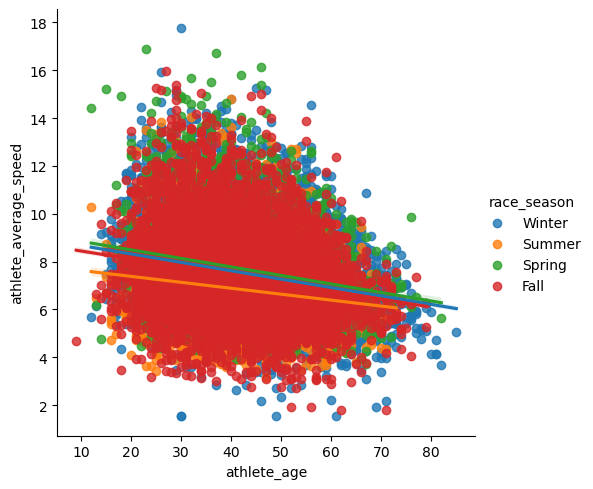

# Projects
 A collection of various Data Science projects used for my personal practice.
## 1. Ultramarathon - 11/09/24
- I followed through this video: https://www.youtube.com/watch?v=4sZFkPw87ng
- I performed exploratory data analysis on ultra-marathon races (file not included in repo) 
- I worked using pandas, numpy, matplotlib, and seaborn
- As a final task, I plotted the speed of runners during different seasons and found that runners were slower in summer compared to other seasons, as one would expect. 

